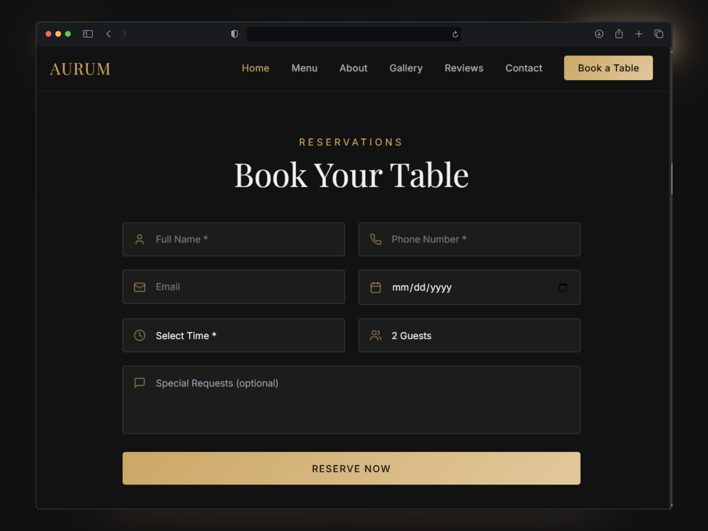
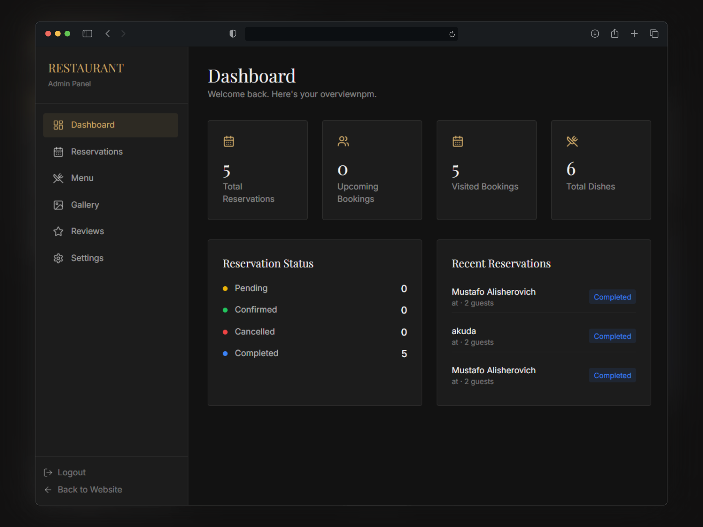

# 🍽️ Restaurant Booking System - Frontend

Modern restaurant booking and management frontend built with React.  
Includes a customer-facing website and an admin dashboard for managing reservations, menu items, reviews, and restaurant settings.

> Backend Repository:  
https://github.com/MustafoAlisherovich/aurum.backend

---

## 📸 Screenshots

### Homepage


### Booking Form


### Admin Dashboard


---

## ✨ Features

### Customer Website
- Responsive modern UI
- Interactive booking system
- Real-time booking validation
- Dynamic menu categories
- Gallery and customer reviews
- Contact and About pages
- Smooth animations with Framer Motion

### Admin Dashboard
- Reservation management
- Booking status updates
- Menu management
- Gallery image uploads
- Review moderation
- Restaurant settings panel
- Analytics overview

---

## 🛠️ Tech Stack

- React.js
- Tailwind CSS
- Framer Motion
- Axios
- Vite

---

## ⚙️ Environment Variables

Create a `.env` file in the root directory:

```env
VITE_SERVER_URL=http://localhost:3000/api/
```

---

## 📦 Installation

Clone the repository:

```bash
git clone https://github.com/MustafoAlisherovich/aurum.frontend.git
cd aurum.frontend
```

Install dependencies:

```bash
npm install
```

Start development server:

```bash
npm run dev
```

---

## 📁 Project Structure

```bash
src/
 ├── components/
 ├── pages/
 ├── hooks/
 ├── assets/
 └── lib/

```

---

## 🌐 Live Demo

Frontend:  
https://aurum.mustafoalisherovich.ru

---

## 🤖 Development Notes

Frontend scaffolded using Lovable AI and customized with:
- API integrations
- Business logic
- State management
- UI improvements
- Admin dashboard functionality

---

## 👨‍💻 Developed By

Mustafo Alisherovich

Responsibilities:
- Backend Architecture
- API Design
- Database Design
- Frontend Integration
- Admin System Logic

---

## 📄 License

This project is licensed under the MIT License - see the [LICENSE](./LICENSE) file for details.
